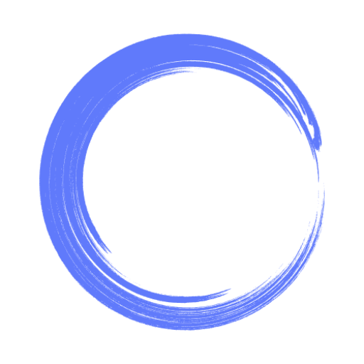

<p align="center">
  
</p>

<h1 align="center"><b>Kaizen Read Later</b></h1>

A local-first desktop application for saving and reading articles, built with [Electrobun](https://blackboard.sh/electrobun/).

## Features

- 📚 Save articles from any URL
- ⭐ Mark articles as favorites
- 📦 Archive articles you've read
- 🏷️ Organize with tags
- 🔍 Full-text search
- 📖 Distraction-free reading
- 🌙 Dark mode support
- 💾 100% local storage (SQLite)

## Prerequisites

### Required
- [Bun](https://bun.sh/) >= 1.0
- [Docker Desktop for Windows](https://www.docker.com/products/docker-desktop/) (for Crawl4AI article extraction)

### Optional (for better article extraction)
- [Crawl4AI](https://docs.crawl4ai.com/) - Self-hosted web crawler

## Getting Started

### 1. Start Crawl4AI (Optional but Recommended)

This app targets **Windows**, so the expected setup is:
- Kaizen runs as a native Windows desktop app
- Crawl4AI runs separately in **Docker Desktop**
- Kaizen connects to it at `http://localhost:11235`

A ready-to-use `docker-compose.yml` is included in this project.

From PowerShell in `kaizen-electro-bun/`:

```powershell
docker compose up -d crawl4ai
```

Or use the Bun script:

```powershell
bun run crawl4ai:up
```

Verify it's running:

```powershell
Invoke-WebRequest http://localhost:11235/health
```

Open the Crawl4AI playground:
- http://localhost:11235/playground

> **Note:** Without Crawl4AI, the app falls back to basic Readability extraction. That works for simpler sites, but Crawl4AI is better for JavaScript-heavy pages.

### 2. Install Dependencies

```bash
bun install
```

### 3. Run Development Server

With Hot Module Replacement (HMR):
```bash
bun run dev:hmr
```

Without HMR:
```bash
bun run start
```

### 4. Build for Production

```bash
bun run build
```

## Project Structure

```
kaizen-desktop/
├── src/
│   ├── bun/                    # Main process (Bun runtime)
│   │   ├── index.ts            # Entry point
│   │   ├── database/           # SQLite operations
│   │   │   └── db.ts           # Database layer
│   │   ├── extraction/         # Article extraction
│   │   │   ├── crawl4ai.ts     # Crawl4AI client
│   │   │   ├── readability.ts  # Fallback extraction
│   │   │   └── extractor.ts    # Combined extractor
│   │   └── rpc/                # RPC handlers
│   │       └── handlers.ts     # API handlers
│   │
│   └── mainview/               # Webview (UI)
│       ├── App.tsx             # Main React component
│       ├── main.tsx            # React entry
│       ├── index.css           # Tailwind styles
│       └── lib/                # Client utilities
│           ├── rpc-client.ts   # RPC client
│           └── types.ts        # TypeScript types
│
├── electrobun.config.ts        # Electrobun configuration
├── package.json
├── tailwind.config.js
├── tsconfig.json
└── vite.config.ts
```

## Architecture

```
┌─────────────────────────────────────────────────────────────────────┐
│                     Kaizen Desktop App                              │
├─────────────────────────────────────────────────────────────────────┤
│                                                                     │
│  ┌─────────────────┐    RPC     ┌─────────────────────────────┐     │
│  │   Main Process  │◄──────────►│      Webview (UI)           │     │
│  │   (Bun/TS)      │            │   (React + Tailwind)        │     │
│  │                 │            │                             │     │
│  │  - SQLite DB    │            │   - Library View            │     │
│  │  - RPC Handlers │            │   - Reader View             │     │
│  │  - Crawl4AI SDK │            │   - Tags/Favorites          │     │
│  └────────┬────────┘            └─────────────────────────────┘     │
│           │                                                         │
│           │ HTTP :11235                                             │
│           ▼                                                         │
│  ┌─────────────────┐         ┌─────────────────┐                    │
│  │  Crawl4AI       │         │  Local Storage  │                    │
│  │  (Docker)       │         │  - SQLite       │                    │
│  │                 │         │  - Article MD   │                    │
│  │  - Chromium     │         │  - User Prefs   │                    │
│  │  - JS Rendering │         └─────────────────┘                    │
│  │  - Markdown Gen │                                                │
│  └─────────────────┘                                                │
│                                                                     │
└─────────────────────────────────────────────────────────────────────┘
```

## Crawl4AI Setup

Crawl4AI is a self-hosted web crawler that provides robust article extraction. It handles:
- JavaScript-heavy pages
- Bot detection evasion
- Automatic Markdown conversion
- Content filtering

### Docker Setup

The included Compose file is the recommended setup on Windows.

```powershell
docker compose up -d crawl4ai
docker compose logs -f crawl4ai
docker compose down
```

Bun script shortcuts:

```powershell
bun run crawl4ai:up
bun run crawl4ai:logs
bun run crawl4ai:down
```

### Access the Playground

Visit http://localhost:11235/playground to test article extraction interactively.

## Data Storage

All data is stored locally in:
- `kaizen.db` - SQLite database containing articles, tags, and settings

You can export/import your data through the Settings menu (coming soon).

## Development

### Available Scripts

| Command | Description |
|---------|-------------|
| `bun run start` | Build and run the app |
| `bun run dev` | Development mode with file watching |
| `bun run dev:hmr` | Development with Hot Module Replacement |
| `bun run build` | Build for production |
| `bun run build:canary` | Build canary version |

### Adding New RPC Methods

1. Add the handler in `src/bun/rpc/handlers.ts`
2. Add the method signature to `src/mainview/lib/rpc-client.ts`
3. Use in React components via `api` or `rpc()` function

## License

MIT

## Resources

- [Electrobun Documentation](https://blackboard.sh/electrobun/docs/)
- [Crawl4AI Documentation](https://docs.crawl4ai.com/)
- [Bun Documentation](https://bun.sh/docs)
